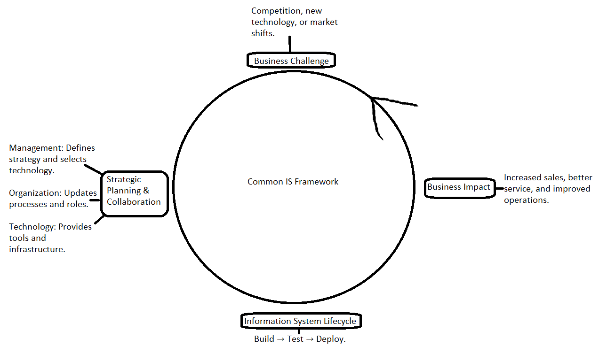

# Management-of-Information-Systems-Material
Management of Information Systems Material (NOTE: WORK IN PROGRESS... MANY MISSPELLINGS AND GRAMMAR MISTAKES IN ALL SECTIONS)

Welcome to this repository designed to support teaching and research in Information Systems.  
The materials here offer a comprehensive, generalized framework for understanding how businesses address challenges through information systems strategy, technology adoption, and organizational collaboration.

> Inspired by common IS frameworks (e.g., Laudon & Laudon, *Management Information Systems*).

#### Steps in the Model
1. **Business Challenge** — Competition, new technology, or market shifts.
2. **Strategic Planning & Collaboration** —  
   - *Management:* Defines strategy and selects technology.  
   - *Organization:* Updates processes and roles.  
   - *Technology:* Provides tools and infrastructure.
3. **Information System Lifecycle** — Build → Test → Deploy.
4. **Business Impact** — Increased sales, better service, and improved operations.

## Contents

- **diagrams/**: Original diagrams illustrating core concepts.  
- **slides/**: Slide decks and presentation outlines for classroom use.  
- **lectures/**: Detailed lecture notes and scripts.  
- **exercises/**: Case studies, quizzes, and student activities.  
- **references/**: Bibliography and annotations for key literature.  
- **data/**: Sample datasets used in exercises or demonstrations.  
- **templates/**: Downloadable worksheets and templates for classroom use.

##### License

This work is licensed under a [Creative Commons Attribution-NonCommercial 4.0 International License](https://creativecommons.org/licenses/by-nc/4.0/).

You are free to share and adapt this material for non-commercial purposes,  
as long as you give appropriate credit and indicate if changes were made.  
Commercial use is **not** allowed without permission.

